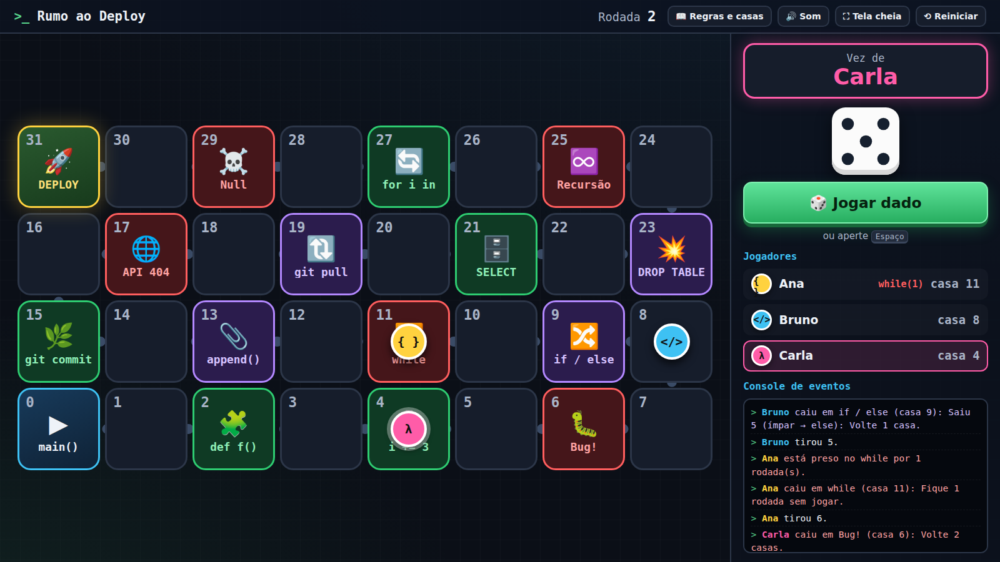
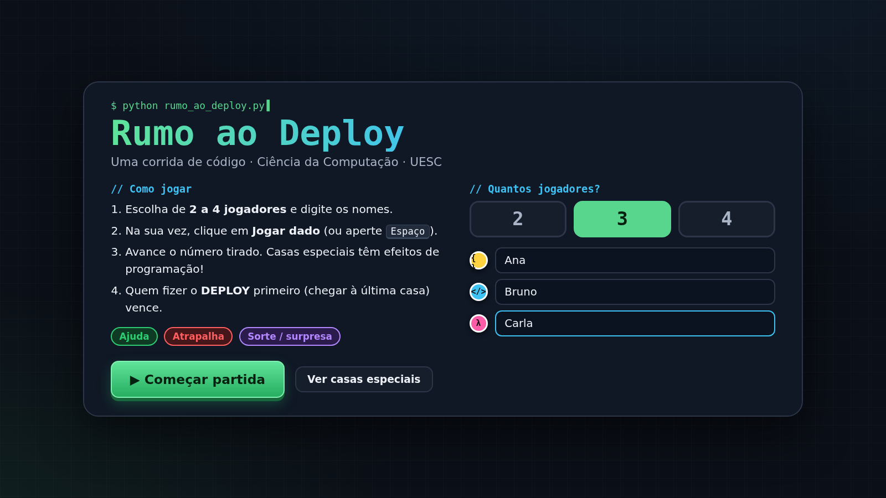

# 🚀 Rumo ao Deploy

> Um jogo de tabuleiro no navegador, para até 4 jogadores, com temática de programação. Foi criado para o stand de **Ciência da Computação da UESC** no Circuito de Profissões.

**▶ [Jogar agora](https://gilbertcm.github.io/rumo-ao-deploy/)**



## Sobre o projeto

O objetivo é levar o visitante de `main()` até o **DEPLOY** antes dos outros jogadores. Pelo caminho aparecem casas com conceitos de programação, e cada uma tem um efeito no jogo:

| Casa                                                 | Efeito                                                          |
| ---------------------------------------------------- | --------------------------------------------------------------- |
| 🔁 `while`                                           | Laço sem condição de parada: fica uma rodada sem jogar          |
| 📎 `append()`                                        | Vai para o fim da lista, ou seja, para a casa do último jogador |
| ➕ `i += 3`                                          | Avança 3 casas                                                  |
| 🔀 `if / else`                                       | Rola um dado extra: se sair par, avança; se sair ímpar, volta   |
| 🧩 `def f()`                                         | Função reutilizável: joga de novo                               |
| 🔃 `git pull`                                        | Troca de lugar com o líder                                      |
| 💥 `DROP TABLE`                                      | Todos os adversários voltam 2 casas                             |
| 🐛 `Bug!` · 🌐 `API 404` · ♾️ `Recursão` · ☠️ `Null` | Erros que fazem o jogador voltar                                |

Uma partida dura de **5 a 10 minutos**, que é o tempo ideal para quem está visitando o stand.

## Funcionalidades

- De 2 a 4 jogadores, cada um com nome, cor e símbolo próprios (os símbolos ajudam quem tem daltonismo)
- Dado virtual animado e peças que andam casa por casa
- Mensagem explicando o conceito de programação de cada casa especial
- Painel com a vez de quem joga, a posição dos jogadores e um "console de eventos"
- Tela inicial, tela de vitória com ranking e botão de revanche
- Layout adaptável a telas grandes e totens (deitados ou em pé)
- Jogável pelo teclado (`Espaço`/`Enter`) e com efeitos sonoros gerados em tempo real
- **Funciona offline**, sem nenhuma dependência

## Tecnologias

HTML5 · CSS3 (Grid, variáveis CSS, animações) · JavaScript puro (ES6+, Web Audio API, Canvas)

Não usa frameworks nem precisa de etapa de build: basta abrir o `index.html`.

## Como rodar

```bash
git clone https://github.com/gilbertcm/rumo-ao-deploy.git
```

Depois, é só abrir o `index.html` no navegador.

## Como personalizar

As casas especiais, os textos, os efeitos, o tamanho do tabuleiro e a velocidade ficam em **`casas.js`**. Veja um exemplo de casa especial:

```js
{ casa: 4, rotulo: "i += 3", icone: "➕", titulo: "Incremento!",
  texto: "A variável i foi incrementada em 3. Seu progresso também!",
  efeito: { tipo: "avancar", casas: 3 } },
```

Os efeitos disponíveis são: `avancar`, `voltar`, `pularRodada`, `jogarNovamente`, `irPara`, `casaDoUltimo`, `trocarComLider`, `outrosVoltam` e `condicional`.

## Estrutura

```
├── index.html   # telas do jogo (início, partida e vitória)
├── casas.js     # configuração editável: casas especiais e opções
├── jogo.js      # lógica do jogo: turnos, movimento e efeitos
├── estilo.css   # visual
└── docs/        # capturas de tela
```

## Capturas de tela

| Tela inicial                           | Vitória                               |
| -------------------------------------- | ------------------------------------- |
|  |  |

## Como foi feito

Desenvolvido com apoio de IA como ferramenta de programação. A ideia, as regras, o tema e a adaptação para o stand são meus, assim como a revisão e a evolução do código.

## Autor

**Gilbert Carmo Macêdo**, estudante de Ciência da Computação na UESC

[GitHub](https://github.com/gilbertcm) · [LinkedIn](https://www.linkedin.com/in/gilbert_cm)

## Licença

Distribuído sob a licença MIT. Veja o arquivo [LICENSE](LICENSE).
